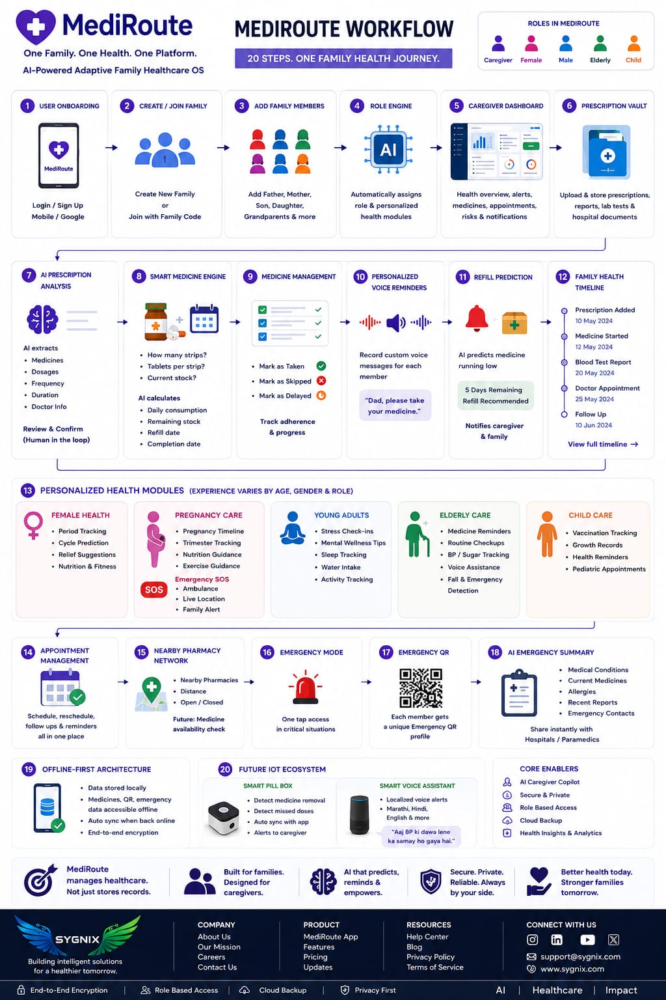
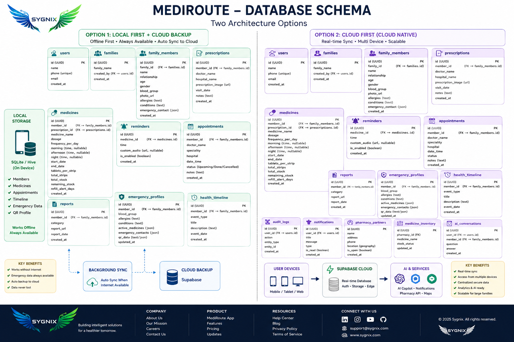

# 🏥 MediRoute

# One Family. One Health. One Platform.

### Adaptive Family Healthcare Operating System

Built with ❤️ by **Team SYGNIX**

🚀 HackArena 2.0 Submission

🌐 https://sygnix.in

---

*"Healthcare apps store records. MediRoute manages healthcare."*

---

# 🌍 The Problem We Witnessed

A few years ago, a close family member underwent major heart surgery.

The surgery was successful.

The recovery was not the difficult part.

Managing healthcare afterwards was.

Medical reports were scattered across folders.

Prescriptions were buried inside WhatsApp chats.

Medicine schedules were written on paper.

Different family members had different pieces of information.

And every time a doctor asked an important question, valuable time was spent searching instead of helping.

That experience raised a simple question:

### Why is family healthcare still fragmented in 2026?

Millions of families face the same challenge every day.

During emergencies, people ask:

* What medicines is the patient taking?
* What allergies do they have?
* What is their blood group?
* What happened during their last hospital visit?
* Where is their latest prescription?

The information exists.

But it is disconnected.

---

# 💡 Introducing MediRoute

MediRoute is an Adaptive Family Healthcare Operating System designed to bring healthcare management for an entire family into a single platform.

Instead of focusing on individual patients, MediRoute focuses on the people who actually manage healthcare:

* Parents
* Children
* Caregivers
* Grandparents
* Families

MediRoute transforms healthcare from a collection of records into a connected healthcare ecosystem.

---

# 📊 Market Validation

Before writing code, we validated the problem.

We conducted user research and healthcare surveys.

### Key Insights

* 74.2% believe Emergency Medical QR Profiles are valuable.
* 71% want centralized caregiver access.
* 58.1% would use emergency healthcare discovery services.
* 64.5% struggle with healthcare record management.

### What We Learned

We initially thought medicine discovery was the problem.

The research revealed something much larger.

Families do not need another healthcare app.

### Families need a healthcare operating system.

---

# 🏗️ Healthcare Workflow Architecture

The entire platform operates through four intelligent healthcare layers.

---

## Phase 01 — Family Healthcare Foundation

Create the healthcare ecosystem.

* User Authentication
* Family Creation
* Family Member Registration
* Healthcare Profile Initialization
* Role Assignment Engine

Output:

A structured Family Healthcare Database.

---

## Phase 02 — Healthcare Intelligence Layer

Transform healthcare information into actionable data.

* Prescription Storage
* Medical Record Vault
* Medicine Image Storage
* Dosage Management
* Healthcare Timeline Generation

Output:

Structured healthcare knowledge.

---

## Phase 03 — Predictive Healthcare Layer

Move from healthcare storage to healthcare management.

* Medication Tracking
* Refill Prediction
* Caregiver Alerts
* Voice Reminders
* Adherence Monitoring

Output:

Proactive healthcare support.

---

## Phase 04 — Emergency Infrastructure Layer

Prepare for moments that matter most.

* Emergency QR Profiles
* Emergency Healthcare Summary
* Critical Information Access
* Offline Availability
* Future IoT Readiness

Output:

Emergency-ready healthcare access.

---

# 👨‍👩‍👧‍👦 Adaptive Healthcare Experience

Healthcare requirements differ across family members.

MediRoute adapts accordingly.

---

## Caregiver Dashboard

The command center.

Features:

* Family Health Overview
* Medicine Monitoring
* Refill Alerts
* Healthcare Notifications
* Emergency Visibility

---

## Women's Health

Personalized support.

Features:

* Period Tracking
* Wellness Monitoring
* Lifestyle Insights

---

## Pregnancy Care

Healthcare support for mothers.

Features:

* Pregnancy Timeline
* Nutrition Guidance
* Appointment Tracking
* Emergency Pregnancy SOS

---

## Elderly Care

Built for parents and grandparents.

Features:

* Medication Assistance
* Routine Health Monitoring
* Voice-Based Reminders
* Healthcare Accessibility

---

## Young Adult Wellness

Daily engagement layer.

Features:

* Wellness Tracking
* Health Awareness
* Stress Monitoring
* Lifestyle Support

---

## Child Healthcare

Preventive healthcare management.

Features:

* Vaccination Tracking
* Pediatric Records
* Growth Monitoring

---

# 💊 Smart Medication Management

Traditional healthcare systems store medicine names.

MediRoute stores:

* Medicine Images
* Dosage Information
* Frequency
* Usage Instructions
* Schedule Details

Why?

Because images are easier to recognize than names.

Especially for:

* Elderly Users
* Caregivers
* Family Members

The goal is simplicity.

---

# 📁 Unified Medical Record Vault

Centralized healthcare storage.

Supported Records:

* Prescriptions
* Medical Reports
* Diagnostic Reports
* Hospital Documents
* Healthcare History

Everything stays organized.

Everything remains accessible.

---

# 🚨 Emergency Infrastructure

Every family member receives an Emergency QR Profile.

Contains:

* Blood Group
* Allergies
* Conditions
* Emergency Contacts
* Critical Medical Information

Designed for:

Hospitals.

Caregivers.

Emergency situations.

Because every second matters.

---

# 🗄️ Database Architecture

The entire platform is designed around a scalable healthcare architecture.

Core Entities:

* Users
* Families
* Family Members
* Prescriptions
* Medicines
* Reports
* Appointments
* Notifications
* Emergency Profiles

Designed for future scalability.

Built for healthcare relationships.

---

# 🔌 Future Healthcare Infrastructure

Healthcare should not stop when internet connectivity fails.

Healthcare should not depend entirely on smartphones.

This is where our long-term vision begins.

---

# MediRoute Smart Pill Box

Future Hardware Ecosystem

Capabilities:

* Detect Medicine Removal
* Detect Missed Doses
* Notify Caregivers
* Track Medication Adherence

---

# MediRoute Voice Assistant

Localized Voice Healthcare Support

Languages:

* English
* Hindi
* Marathi

Examples:

"Please take your BP medicine."

"Aaj diabetes ki dawa lene ka samay ho gaya hai."

Built specifically for elderly users.

---

# Offline-First Healthcare

Critical healthcare information should remain accessible:

* Without internet
* During emergencies
* During network outages

Future versions of MediRoute will prioritize:

* Local Data Storage
* Offline Emergency Access
* IoT Synchronization
* Healthcare Reliability

---

# What We Built During HackArena 2.0

This project was developed during an intensive 8-hour innovation sprint.

Our focus was not to build isolated features.

Our focus was to validate the complete healthcare experience.

During this sprint we successfully designed and implemented:

✅ Caregiver Experience

✅ Women's Health Experience

✅ Pregnancy Care Experience

✅ Elderly Care Experience

✅ Child Healthcare Experience

✅ Emergency Infrastructure

✅ Family Healthcare Navigation

✅ Workflow Architecture

✅ Database Design

✅ Future IoT Architecture

---

# National Sprint Vision

If selected for the next stage, our roadmap includes:

### Stage 1

Backend Integration

* Authentication
* Cloud Infrastructure
* Healthcare Database

### Stage 2

AI Caregiver Assistant

* Healthcare Insights
* Healthcare Summaries
* Record Intelligence

### Stage 3

IoT Healthcare Ecosystem

* Smart Pill Box
* Voice Reminder Hardware
* Medication Compliance Tracking

### Stage 4

Offline Healthcare Network

* Emergency Access
* Local Healthcare Infrastructure
* Resilient Healthcare Systems

---

# Why MediRoute Exists

We are not building another healthcare application.

We are not building another medicine reminder.

We are not building another medical records platform.

We are building a Family Healthcare Operating System.

A platform where:

* Families stay connected.
* Caregivers stay informed.
* Elderly users stay supported.
* Emergencies become manageable.
* Healthcare becomes proactive.

Standing in Bengaluru, the startup capital of India, we are not simply presenting a hackathon project.

We are validating the foundation of a future healthcare company.

---

# About SYGNIX

**SYGNIX** is a technology-driven startup focused on building impactful solutions across healthcare, AI, software, and emerging technologies.

🌐 Website: https://sygnix.in

Our mission is simple:

### Build technology that solves real-world problems.

---

# MediRoute

### The AI Caregiver For Families

One Family.

One Health.

One Platform.

---

Built by Team SYGNIX 🚀

https://sygnix.in

